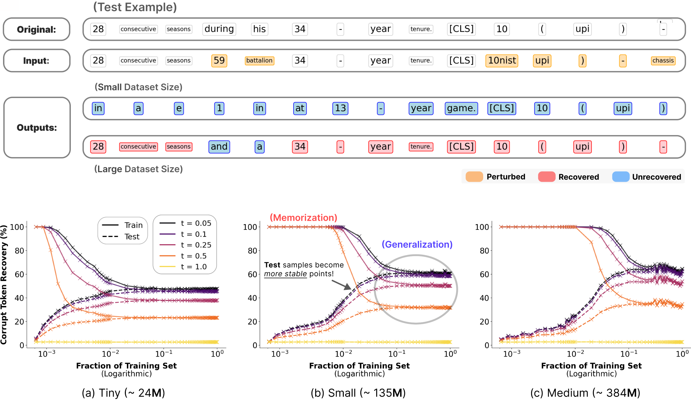

# Language Diffusion Models are Associative Memories Capable of Retrieving Unseen Data

Official code for the paper:

> **Language Diffusion Models are Associative Memories Capable of Retrieving Unseen Data**
> Bao Pham, Mohammed J. Zaki, Luca Ambrogioni, Dmitry Krotov, Matteo Negri
> arXiv:2604.26841 · [paper](https://arxiv.org/abs/2604.26841) · [checkpoints](https://huggingface.co/lemoncmd/lldms-associative-memory)



*Corrupt a sequence, let the model denoise it, and count how many original tokens come back.
**Top:** the same perturbed test example recovered by a model trained on a small dataset (blue,
unrecovered) versus a large one (red, recovered). **Bottom:** corrupt-token recovery against the
fraction of LM1B used for training, for each model size. Solid lines are training examples, dashed
lines are held-out test examples, colours are corruption levels `t`. Training curves fall and test
curves rise until they meet — the memorization-to-generalization transition.*

## Overview

A uniform-state discrete diffusion language model (UDDM) behaves like an **associative memory**:
corrupt a sequence, run the model, and tokens inside a basin of attraction snap back to their
original values. This repo trains UDDMs on nested subsets of LM1B and uses that recovery test to
find where memorization ends and generalization begins.

The result is a sharp transition governed by **how much data the model saw**. On small training
sets, training examples are recovered perfectly while test examples are not — the model has stored
its training data. As the training set grows, basins around training examples shrink and basins
around unseen test examples expand, until the two converge and held-out text is as stable as
training text. The same transition is detectable from the **conditional entropy** of predicted
tokens alone, which needs no access to the training set and so works on deployed models.

## What's in this repo

The central experiment is a **model size × training-set size** sweep. Three UDDMs are each trained
on 54 nested subsets of [LM1B](https://huggingface.co/datasets/lm1b) — from 0.01% of the corpus up
to 100% — every one for exactly 1,000,000 steps. Holding architecture and step count fixed while
sweeping only the dataset size is what isolates the transition above to a single variable.

| Size | Backbone | `hidden_size` | `n_blocks` | `n_heads` | Params |
|---|---|---|---|---|---|
| `tiny`   | `ddit` | 256  | 8  | 8  | 23.7 M |
| `small`  | `ddit` | 768  | 12 | 12 | 139.3 M |
| `medium` | `ddit` | 1024 | 24 | 16 | 384.0 M |

The two measurements in the paper map onto two families of scripts:

| Paper | Code |
|---|---|
| Token recovery / basins of attraction around train and test examples | `eval_fixed_point.py`, `eval_fixed_point_multi.py` |
| Conditional entropy as a probe for the transition | `eval_entropy.py`, `eval_entropy_multi.py`, `eval_entropy_overtime.py` |

## Checkpoints

All 162 trained checkpoints (~473 GB) are released on the Hugging Face Hub:

**https://huggingface.co/lemoncmd/lldms-associative-memory**

```python
from huggingface_hub import hf_hub_download

# one checkpoint: tiny model trained on 1% of LM1B
path = hf_hub_download(
    repo_id="lemoncmd/lldms-associative-memory",
    filename="tiny/lm1b-tiny-0.01.ckpt",
)
```

They are organized `<size>/lm1b-<size>-<subset>.ckpt`, where `<subset>` is the fraction of LM1B the
model was trained on — the x-axis of the transition.

## Setup

Requires Python 3.12 and CUDA 12.6.

```bash
conda create -n duo python=3.12
conda activate duo
pip install -r requirements.txt

# flash-attn is installed last, because it needs torch already present.
# Prefer a prebuilt wheel matching your torch/CUDA/Python from
# https://github.com/Dao-AILab/flash-attention/releases
# (this project used 2.7.3 for cu12 / torch 2.6 / cxx11abiTRUE / cp312):
pip install flash_attn-2.7.3+cu12torch2.6cxx11abiTRUE-cp312-cp312-linux_x86_64.whl

# ...or build from source, which takes roughly an hour:
pip install flash-attn==2.7.3 --no-build-isolation
```

Versions are pinned to the environment the released checkpoints were trained in. flash-attn is
required for the fused attention path; without it `models/dit.py` falls back to xFormers, then to
plain PyTorch attention.

## Usage

Configuration is [Hydra](https://hydra.cc)-based; everything under `configs/` is overridable from
the command line. `data.subset` is the key knob — the fraction of the training set.

```bash
# train the medium model on 25% of LM1B
python main.py model=medium data.subset=0.25

# conditional entropy: the probe for the memorization-to-generalization transition
python eval_entropy.py model=tiny data.subset=0.01 \
    eval.checkpoint_path=/path/to/lm1b-tiny-0.01.ckpt

# token recovery / basins of attraction
python eval_fixed_point.py model=tiny data.subset=0.01 \
    eval.checkpoint_path=/path/to/lm1b-tiny-0.01.ckpt

# sampling
python generate.py model=small data.subset=1.0 \
    eval.checkpoint_path=/path/to/lm1b-small-1.0.ckpt
```

SLURM launchers that run the full 3 × 54 sweep live in `aimos_scripts/` and `scripts/`.

## Layout

```
main.py                 training entry point (Hydra)
algo.py                 diffusion algorithms (duo, mdlm, sedd, d3pm, ar, distillation)
trainer_base.py         Lightning module: training / eval loops
dataloader.py           LM1B + OpenWebText loading, subset sampling
models/                 ddit / dimamba backbones
metrics.py              perplexity and related metrics
eval_entropy*.py        conditional-entropy evaluation
eval_fixed_point*.py    token recovery / basin-of-attraction analysis
generate*.py            sampling
configs/                Hydra configs (model, data, algo, noise, lr_scheduler, ...)
aimos_scripts/          SLURM sweep launchers
nbs/                    analysis notebooks and paper figures
```

## Citation

```bibtex
@misc{pham2026languagediffusionmodelsassociative,
      title={Language Diffusion Models are Associative Memories Capable of Retrieving Unseen Data},
      author={Bao Pham and Mohammed J. Zaki and Luca Ambrogioni and Dmitry Krotov and Matteo Negri},
      year={2026},
      eprint={2604.26841},
      archivePrefix={arXiv},
      primaryClass={cs.LG},
      url={https://arxiv.org/abs/2604.26841},
}
```
